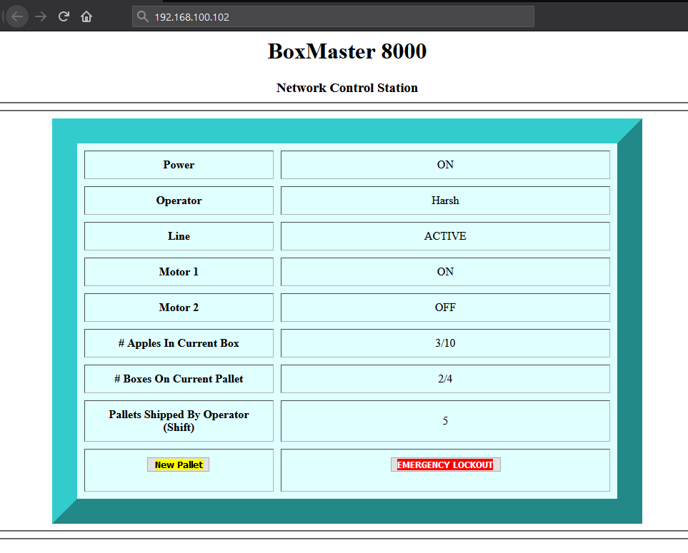
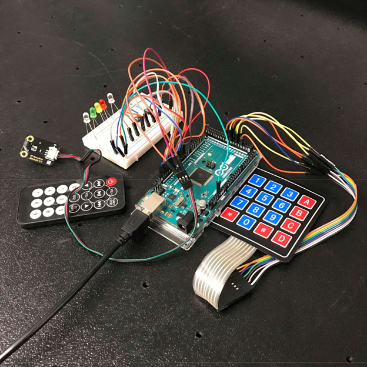

#  Network Control Station for Simulated Assembly Line

## Industrial Data Communications ATMN 321 -- Fall 2018

   

## OVERVIEW

Web-accessible TCP/IP network control station GUI for a simulated assembly line process. Visual Basic, HTML/PHP, and Arduino.

## DESCRIPTION

Adds two-way remote network communications to an earlier simulated process control lab. Each potential state of the assembly line running on the microcontroller is assigned a unique char variable that ynced to a local Visual Basic program via serial port. From there, the VB program parses the incoming char serial stream, and writes the changes to the file 'index.html' being dsplayed by the server over the network.

When the simulated assembly line reaches four full boxes on a single pallet, the process holds until a new pallet is inputted via the 'New Pallet' button on the web station. Clicking the “Emergency Lockout” button executes the reboot() subroutine actuated by the physical stopPB, only remotely. The html buttons write to the 'serverstream.txt' file in the server's htdocs directory, which is monitored by the local VB program for changes, which are then parsed and broadcast back to the assembly line microcontroller via serial port.

## MATERIALS

- Arduino 2560 Mega Microcontroller Rev3	  
  
- FIT0129 4x4 Keypad Module 	   		
         
- DFR0107 IR Remote Kit for Arduino   
          
- USB 2.0 type A-to-B cable      

- Generic NO Momentary Pushbuttons (**x3**)

- Generic LEDs (**x5**)

## I/O

| Input                                         | Label     |                          Pin |
|-----------------------------------------------|-----------|------------------------------|
| Momentary push button 1		                | startPB   | 2                            |
| Momentary push button 2 		   	            | stopPB    | 6                            |
| Keypad                                        | myKeypad  | 48, 7, 44, 3, 40, 39, 36, 35 |
| IR Module                                     | irrecv    | 7                            |

 

| Output                             | Label  | Pin |
|------------------------------------|--------|-----|
| Motor 1 (**Blue LED 1**)           | motor1 | 8   |
| Motor 2 (**Blue LED 2**)           | motor2 | 12  |
| Red LED							 | r      | 9   |
| Yellow LED                         | y      | 10  |
| Green LED						     | g      | 11  |

## LAYOUT

 

 

